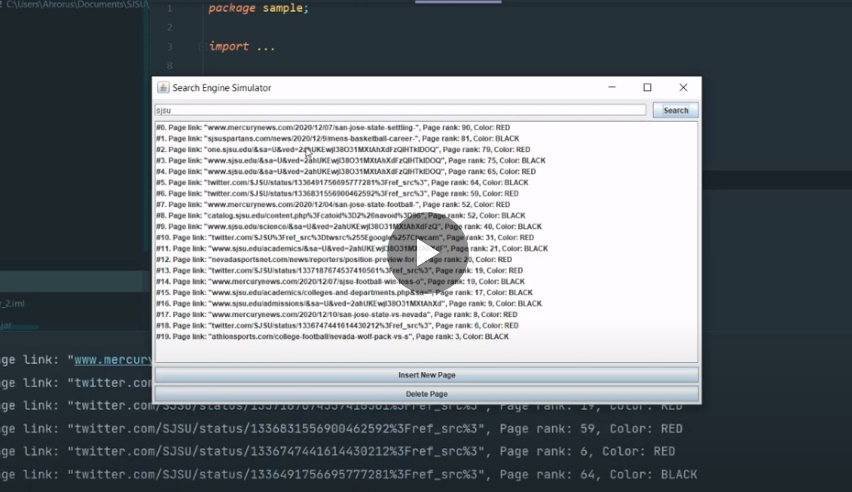

# Search_Engine_Simulator 2

>Search engine simulator 2 made using Java Swing GUI, implementing Red Black Tree 
> data structure. The purpose of this project is to demonstrate how pages inserted, 
> deleted, and sorted by their ranks, and how effective RB Trees are.

```diff 
- The source code is secured in the archive, and a password is required to access it. 
It was done  to prevent future students from copying it. 
Please, contact me if you need the access to the source code, and be sure state the reason.
```

To launch the application, double click the **SearchEngineSimulator2.jar** executable file. JDK 8 was used during the development of this application.

## Recorded Demo

[](https://youtu.be/ur_QMqmAoO8)

